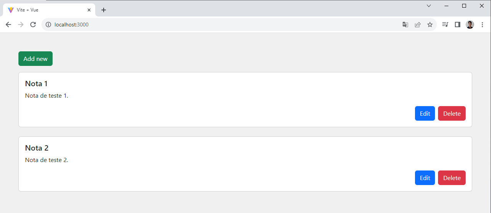

# Bloco de Notas em VUEJS

Projeto realizado seguindo passo a passo em [The Codeholic Channel on Youtube](https://www.youtube.com/watch?v=w-ngSAMlspA&t=1082s).

## Como rodar?

- npm install
- npm run dev